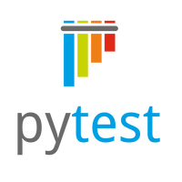

## Проект UI автотестов demoqa.com

<!-- Технологии -->

### Используемые технологии

  <code></code>
  <code></code>
  <code></code>
  <code></code>
 <code></code>
  <code></code>
  <code></code>
  <code></code>
  <code></code>

### Что выполняет тест:
- [x] Заполняет данные формы
- [x] Отправляет заполненные данные
- [x] Проверяет правильность заполненных данных

<!-- Jenkins -->

###  Запуск проекта в Jenkins

### [Job](https://jenkins.autotests.cloud/job/qa_quru_jenkins/)

##### При нажатии на "Собрать сейчас" начнется сборка тестов и их прохождение, через виртуальную машину при помощи Selenoid.

<!-- Allure report -->

###  Allure report

##### После прохождения тестов, результаты автоматически сохраняются. Чтобы посмотреть Allure отчет нужно нажать на иконке allure report у сборки.

##### Во вкладке Suites находятся подробные данные о прохождении теста с приложенными логами, скриншотами и видео о прохождении теста

##### Видео прохождение теста

<!-- Telegram -->

###  Интеграция с Telegram
##### После прохождения тестов, в Telegram bot приходит сообщение с графиком и небольшой информацией о тестах, а также ссылка на allure report.

